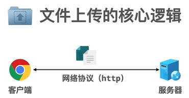
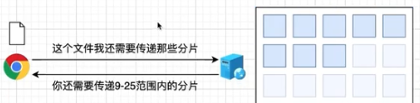

# 正确的学习方式：理解原理+原生实现


## 1.css变量的妙用

js和css巧妙结合，通过js设置变量的值，然后引发后续css的正常操作

涉及知识点

* [css自定义属性](https://developer.mozilla.org/zh-CN/docs/Web/CSS/var)

* [setProperty](https://developer.mozilla.org/zh-CN/docs/Web/API/CSSStyleDeclaration/setProperty)

## 2.图片转 base64

> 目的: 不需要网络传输，直接本地预览上传的图片

涉及知识点：

[readAsDataURL](https://developer.mozilla.org/zh-CN/docs/Web/API/FileReader/readAsDataURL)

url地址叫做统一资源定位符,通过一个字符串获取资源的数据

[data url](https://en.wikipedia.org/wiki/Data_URI_scheme) 地址里面包含数据

MIME类型有（使用字符串描述资源格式）

* text/plain 表示纯文本
* application/json 表示json格式的数据
* application/javascript js代码的MIME类型

base64指可以将任何二进制数据转换成纯文本的格式，有一套算法来运算的，至于为啥是64呢？是因为这个纯文本可能出现的字符有64个，js提供了一些方法实现：base64和纯文本之间的转换

* 编码: base64格式

```js
btoa('alert(123)') // 'YWxlcnQoMTIzKQ=='
```

* 解码: base64格式

```js
atob('YWxlcnQoMTIzKQ==') // 'alert(123)'
```

## 3.面向对象购物车

* 面向对象编程
* 添加购物车的动画效果：商品以抛物线的形式加入购物车

## 4.参数归一化思想

## 5.进入/退出全屏

## 6.文件上传系列 🔥

> 文件上传的本质：网络传输



客户端（前端）

1. 界面交互：样式、交互逻辑、运算

2. 网络通信（协议）：

* 消息格式：二进制、base64编码
* 传输方式：一次传输、分段传输；一个文件/多个文件

服务器（后端）

1. 存储：把数据存成一个文件，放在本地或者服务器上
2. 安全：文件放在服务器是否安全（服务器一般拒绝存储可执行文件，因为它认为会造成一些安全隐患）
3. 访问控制：外界如何访问该文件（通过URL地址访问该文件）

### 拖拽上传

* 界面交互：拖拽
  利用拖拽API实现界面交互而已
* 网络通信：上传

### 裁剪上传原理 🔥

核心技术点

* 如何实现本地预览
* 如何实现图片的部分上传

---- 原理

1. 先选择文件，然后本地预览
2. 使用基础的js开发完成图片裁剪，得到裁剪信息
3. 利用这些信息生成canvas，最终生成file对象
4. 使用ajax把这个file对象传到服务器

### 大文件分片上传

思考🤔️ 为啥要进行分片上传呢？

1. 较大的文件单文件上传，请求比较耗时，若请求期间出现问题：如网络中断
需要将整个文件重新上传一遍，这样用户体验很不好、也很浪费资源

2. 所以在做大文件上传的时候，会对文件进行分片。
客户端：

* 首先把整个的大文件数据，分成一个一个的数据小块（单独的小文件）
* 然后利用单文件上传把这些小文件依次传到服务器，当最后把文件全部传输完成之后

---

核心技术点 🔥

* 图片如何分片？

服务器端

* 使用程序把整个文件的小数据组装起来，形成一个完整的文件

---

场景: 上传分片的过程中，网络断开，下次接着上传，之前上传过的分片，就不需要再次上传了，这就属于文件秒传 🔥

文件秒传原理: 就是和服务器的一次对话，通过一次ajax请求，客户端就能够知道后续该从哪里接着上传文件
在这个交换过程中，客户端必须告知服务器一个关键信息：什么是这个文件？？
找到一种能够唯一代表这个文件的标识，这个就是文件hash (它是一种算法：把任何数据换算成一个固定长度的字符串，换算过程是单向不可逆的，也就是说：不能通过字符串 -推导x> 原始数据 )
hash对数据的变化非常敏感，一旦发现数据变化，会重新生成新的hash值。

> 利用文件的hash值，代表文件的整个内容，从 数据 -> hash值 的过程，称为hash算法
hash算法：md5 (第三方库：spark-md5)
[js-spark-md5](https://github.com/satazor/js-spark-md5)
[spark-md5](https://www.bootcdn.cn/spark-md5/)

⚠️ 计算文件的hash值
不推荐一次性计算整个文件的hash，原因如下:

计算文件的hash值，需要全部获取文件的数据
假设该文件是一个100G的高清电影，把这些数据全部读到内存里面，然后计算hash值，内存吃不消啊🤔️

推荐✅ 分块计算（这种算法叫做增量算法）

1. 先用一块数据计算出一个结果，计算过后这块数据就不要了
2. 接着用下一块数据和之前的结果，一起来计算一个新的结果
3. ... 拿一块计算完毕扔掉...

```js
  /*
    * 分片计算hash
    * @思路：
    *   1. 先读取第一个分块
    *   2. 然后递归调用自身，再读下一个分块
    * 
    * 计算hash比较耗时间，一般不会放在主线程进行，一般会单独开启一个线程来处理 （web worker）
    * 这样避免浏览器卡死
    * 
    * https://developer.mozilla.org/zh-CN/docs/Web/API/Web_Workers_API/Using_web_workers
    * https://juejin.cn/post/7139718200177983524
    * 
    * 放到单独线程处理，可能还会发生卡顿，因为它是一个CPU密集的任务，解决方案：🔥
    *  1.先粗略把文件分为几个大块，单独计算每个大块的hash
    *  2.然后再对大块分小块，进行文件上传
    */
```



## 7.长列表虚拟滚动

应用场景

1. 分页：用户体验差（需要点击翻页）
2. 瀑布流：用户体验好（只需要滚动，DOM数量多，影响性能）

海量的数据：虚拟滚动列表 🔥

优质文章：[虚拟滚动列表](https://zhuanlan.zhihu.com/p/444778554)

## 8.drag 拖拽事件

> 感悟：前端高手判断
能否用最简单的知识解决复杂的问题 🔥
对于高手而言，框架/库这些都是工具，这些工具为他所用，但是不受其所限。可用可不用这些工具 - 开发能力！！！🔥

[拖拽API](https://developer.mozilla.org/zh-CN/docs/Web/API/HTMLElement/drag_event)

拖拽API：当一个元素变为可拖拽元素，拖拽它的时候就会触发一系列的事件。
总之拖拽API就是一系列事件的组合

常用功能：拖拽排序、拖拽文件上传等

知识点

1. 为元素添加属性 draggable 变为可拖拽元素
2. 拖拽API的使用
  ondragstart
  ondragover
  ondragenter
  ondrop

## 商品打折数字动画

动画的本质就是数字的变化，如宽高、位置、颜色RGBA的变化

## token无感刷新

登陆成功后，服务器提供两个token：

1. 请求接口的token, 过期时间很短

2. 用于刷新的token（refresh_token），过期时间较长一般是7天/一个月
   应用场景：刷新token一般用在单点登录的

若请求接口的token一旦过期了，就需要请求单独的接口用这个刷新的token换取请求接口的token

无感刷新：请求受保护接口的时候，发现token过期自动更换

```js
/**
 * 优化点：同一时间发出很多请求都失败了，都要去刷新token，导致该函数在某一个时间点
 * 并发执行多次（网络请求并发刷新token的问题，如何解决呢？🔥）
 *  定义全局的promise
 *  1.在函数内判断，存在promise就返回
 *  2.为了让请求期间都使用同一个promise，每次请求拿到结果就清空，这样就避免刷新token并发的情况
 */
```

## 高阶函数应用 🔥

### 插入10万个元素

## css布局总结（常见案例）

### css-下划线导航栏

源码位置：html/underline


```html
<!-- 
  编程思路：css-下划线导航栏
  1. 准备 整体导航结构
  2. 准备 整体导航样式
  3. 添加修饰性下划线
  4. js辅助切换active类
  5. 添加切换时，线的状态

考点
  1. 元素定位
  2. active类名切换， 控制位移
  3. Transition 过渡动画
  4. css波浪线（后继兄弟选择器）
    https://developer.mozilla.org/zh-CN/docs/Web/CSS/Subsequent-sibling_combinator
-->

```

### 步骤条

源码位置：html/steps


```html
 <!-- 
  编程思想：
    1. 准备 基本步骤条结构
    2. 准备 整体样式
    3. 实现 序号自定义
    4. 实现引导线
    5. 基于 active 类名，控制高亮状态
    6. 测试调优

  知识点
    1. flex布局自适应
    2. CSS计数器
    https://developer.mozilla.org/zh-CN/docs/Web/CSS/CSS_counter_styles/Using_CSS_counters
 -->

```

### 多行文本展开（多行文本省略，浮动，复选框）

源码位置：html/unfold


```html
 <!-- 
  需求：
    1.文本内容 多 显示按钮 和 省略号
    2.文本内容 少 不显示按钮 和 省略号
    3.默认 三行省略，支持自定义行数

  编程思维：
    1.准备基本结构样式
    2.控制多行文本省略
    3.控制按钮切换（基于checkbox）
    4.按钮浮动到右下角（清除浮动）
    5.基于选中状态，控制多行行数，完成展开
    6.优化内容少的情况
  
  知识点
    1.多行文本省略
    2.复选框控制状态（巧妙🔥）
    3.浮动&清除浮动技巧
  -->
```
